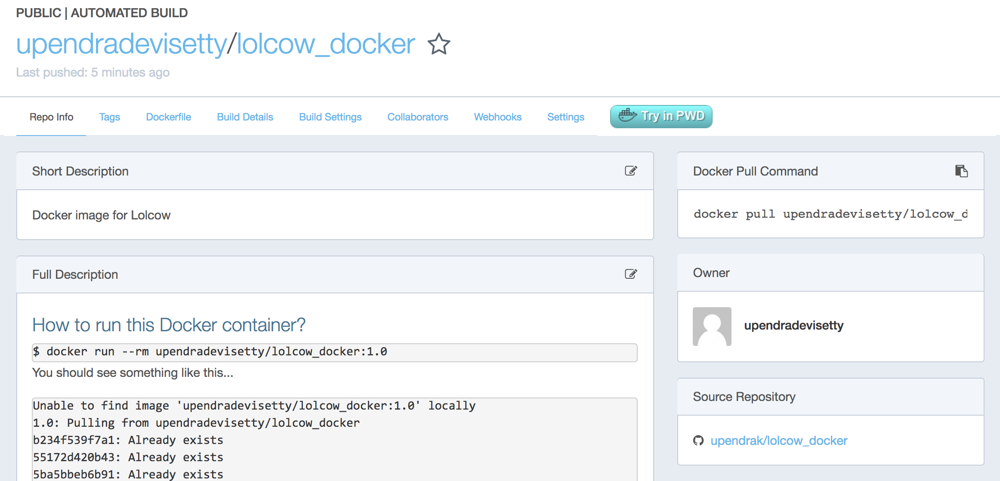
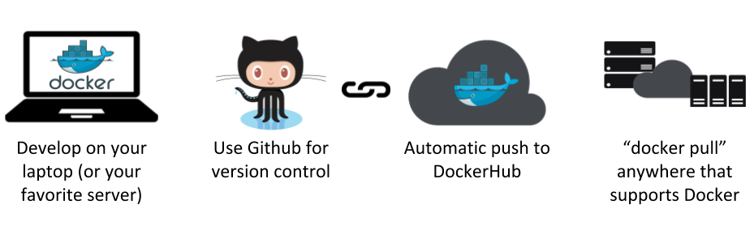
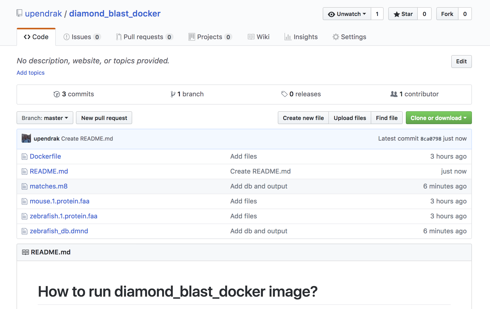
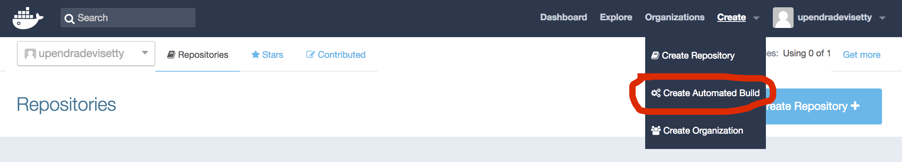
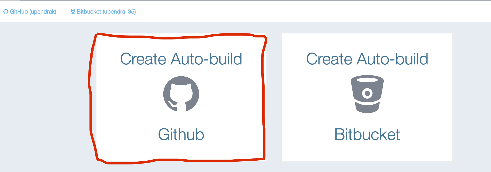
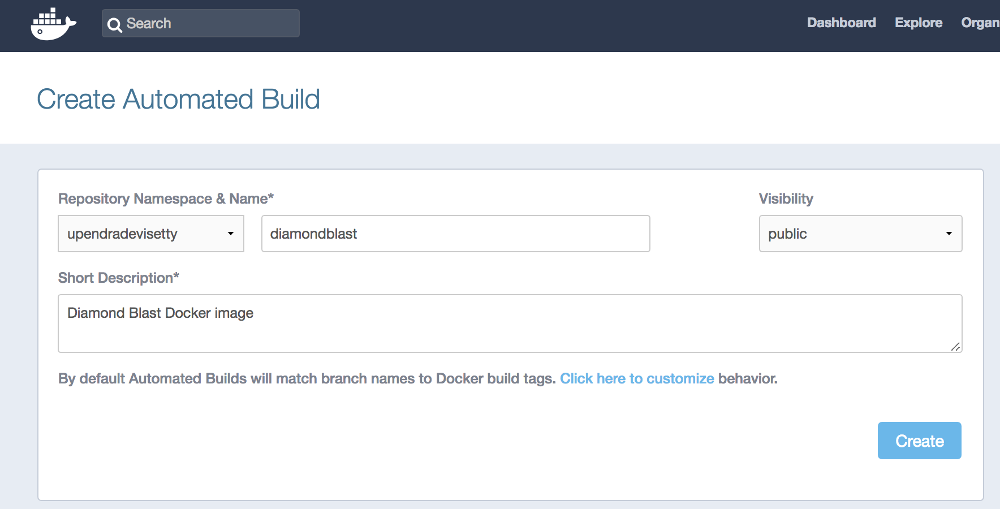
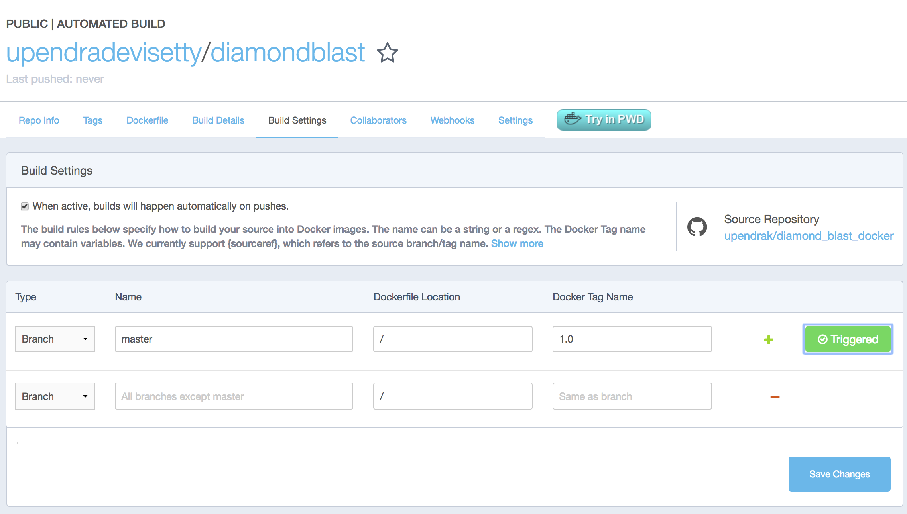
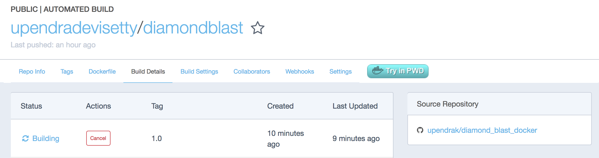
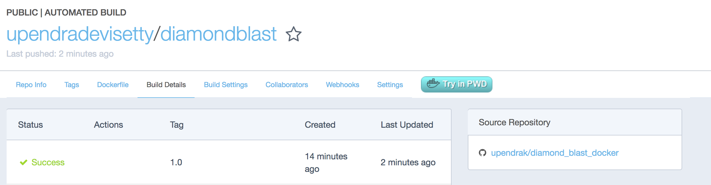

**Introduction to Docker**
--------------------------

.. image:: ../img/docker.jpg
  :width: 150
  :height: 150

This is the introductory session of Docker. The topics include Docker installation, running prebuilt Docker containers, managing data in Docker, and exposing container ports. This session gets you ready to run most of the existing Docker containers.

1. Prerequisites
================

There are no specific skills needed for this tutorial beyond a basic comfort with the command line and using a text editor. Prior experience in python will be helpful but is not required.

2. Docker Installation
======================

Getting all the tooling setup on your computer can be a daunting task, but not with Docker. Getting Docker up and running on your favorite OS (Mac/Windows/Linux) is very easy.

The getting started guide on Docker has detailed instructions for setting up Docker on `Mac <https://docs.docker.com/docker-for-mac/install/>`_/`Windows <https://docs.docker.com/docker-for-windows/install/>`_/`Linux <https://docs.docker.com/install/linux/docker-ce/ubuntu/>`_.

.. Note::

	If you're using an older version of Windows or MacOS you may need to use `Docker Machine <https://docs.docker.com/machine/overview/>`_ instead. All commands work in either bash or Powershell on Windows.

2.1 XSEDE Jetstream / CyVerse Atmosphere Clouds
===============================================

CyVerse staff have deployed an Ansible playbooks called ``ez`` installation which includes Docker that only requires you to type a short line of code.

Start a featured instance on Jetstream [needs to insert link to Jetstream's launching instance].

Type in the following:

.. code-block:: bash

	$ ezd

	* Updating ez docker and installing docker (this may take a few minutes, coffee break!)
	Cloning into '/opt/cyverse-ez-docker'...
	remote: Counting objects: 38, done.
	remote: Compressing objects: 100% (7/7), done.
	remote: Total 38 (delta 1), reused 0 (delta 0), pack-reused 31
	Unpacking objects: 100% (38/38), done.
	* docker was updated successfully

	You shouldn't need to use ezd again on this system, unless you want to update docker itself

	To test docker, type: docker run hello-world

Let's test docker by running `docker run hello-world`

.. code-block:: bash

	$ docker run hello-world

You should see an error like this

.. code-block :: bash

	Got permission denied while trying to connect to the Docker daemon socket at unix:///var/run/docker.sock: Get http://%2Fvar%2Frun%2Fdocker.sock/v1.35/containers/json?all=1: dial unix /var/run/docker.sock: connect: permission denied

This is because Docker needs root access to run Docker commands and so either can append `sudo` infront of each command (and you have sudo permissions on Jetstream instance) or add yourself to the Docker group using following instructions..

.. code-block :: bash

	$ sudo usermod -aG docker ${USER}

Log out and log back in so that your group membership is re-evaluated.

Rerun the ``docker run hello-world`` command to make sure the everything is working fine

.. code-block:: bash

	$ docker run hello-world
	Unable to find image 'hello-world:latest' locally
	latest: Pulling from library/hello-world
	03f4658f8b78: Pull complete
	a3ed95caeb02: Pull complete
	Digest: sha256:8be990ef2aeb16dbcb9271ddfe2610fa6658d13f6dfb8bc72074cc1ca36966a7
	Status: Downloaded newer image for hello-world:latest

	Hello from Docker.
	This message shows that your installation appears to be working correctly.

	To generate this message, Docker took the following steps:
	 1. The Docker client contacted the Docker daemon.
	 2. The Docker daemon pulled the "hello-world" image from the Docker Hub.
	 3. The Docker daemon created a new container from that image which runs the
	    executable that produces the output you are currently reading.
	 4. The Docker daemon streamed that output to the Docker client, which sent it
	    to your terminal.

	To try something more ambitious, you can run an Ubuntu container with:
 	$ docker run -it ubuntu bash

	Share images, automate workflows, and more with a free Docker ID:
 	https://hub.docker.com/

	For more examples and ideas, visit:
 	https://docs.docker.com/engine/userguide/  

3. Running Docker containers
============================

Now that you have everything setup, it's time to get our hands dirty. In this section, you are going to run a container from `Alpine Linux <http://www.alpinelinux.org/>`_ (a lightweight linux distribution) image on your system and get a taste of the ``docker run`` command.

But wait, what exactly is a Container and Image?

**Containers** - Running instances of Docker images. Containers run the actual applications. A container includes an application and all of its dependencies. It shares the kernel with other containers, and runs as an isolated process in user space on the host OS.

**Images** - The file system and configuration of our application which are used to create containers. To find out more about a Docker image, run ``docker inspect hello-world`` and ``docker history hello-world``.

Now that we know what a container and image is, let's run the following command in our terminal:

.. code-block :: bash

	$ docker run alpine

What happened there? Similar to ``docker run hello-world`` command in the demo above, ``docker run alpine`` command fetches the ``alpine:latest`` image from the Docker registry first, saves it in our system. However unlike `hello-world` run, here we don't see any output on the screen. This is because `alpine` and `ubuntu` (which we see later) are base images and doesn't have any executable that produces any kind of output. They however launches a container and since the container doesn't have executable, they quickly exits. You can check the status of container by running the command ``docker ps -l``

.. code-block :: bash

	$ docker ps -l
	CONTAINER ID        IMAGE               COMMAND             CREATED             STATUS                     PORTS               NAMES
	b4219971d6e5        alpine              "/bin/sh"           7 minutes ago       Exited (0) 7 minutes ago                       vigilant_goodall

``docker ps -l`` command shows the status of last container run and as you can see the container has been exited from the ``alpine`` run.

Let's add some commands to the container run this time. 

.. code-block:: bash

	$ docker run alpine echo "Hello world"
	Hello world

OK, that's some actual output. In this case, the Docker client dutifully ran the ``echo`` command in our ``alpine`` container and then exited it. If you've noticed, all of that happened pretty quickly. Imagine booting up a virtual machine, running a command and then killing it. Now you know why they say containers are fast!

Let's say if you wanted to see files and folders inside the ``alpine`` container, then you can run the following

.. code-block:: bash

	$ docker run alpine ls -l /
	total 52
	drwxr-xr-x    2 root     root          4096 Dec 26  2016 bin
	drwxr-xr-x    5 root     root           340 Jan 28 09:52 dev
	drwxr-xr-x   14 root     root          4096 Jan 28 09:52 etc
	drwxr-xr-x    2 root     root          4096 Dec 26  2016 home
	drwxr-xr-x    5 root     root          4096 Dec 26  2016 lib
	drwxr-xr-x    5 root     root          4096 Dec 26  2016 media
	........

When you run ``docker run alpine``, you provided a command ``ls -l /``, so Docker started the command specified and you saw the listing

Try another command.

.. code-block:: bash

	$ docker run alpine sh

Wait, nothing happened! Is that a bug? Well, no. These interactive shells will exit after running any scripted commands such as ``sh``, unless they are run in an interactive terminal - so for this example to not exit, you need to ``docker run -it alpine sh``. You are now inside the container shell and you can try out a few commands like ``ls -l``, ``whoami`` and others.

Before doing that, now it's time to see the ``docker ps`` command which shows you all containers that are currently running.

.. code-block:: bash

	$ docker ps
	CONTAINER ID        IMAGE               COMMAND             CREATED             STATUS              PORTS               NAMES

Since no containers are running, you see a blank line. Let's try a more useful variant: ``docker ps -a``

.. code-block:: bash

	$ docker ps -a
	CONTAINER ID        IMAGE               COMMAND                  CREATED             STATUS                      PORTS               NAMES
	36171a5da744        alpine              "/bin/sh"                5 minutes ago       Exited (0) 2 minutes ago                        fervent_newton
	a6a9d46d0b2f        alpine             "echo 'hello from alp"    6 minutes ago       Exited (0) 6 minutes ago                        lonely_kilby
	ff0a5c3750b9        alpine             "ls -l"                   8 minutes ago       Exited (0) 8 minutes ago                        elated_ramanujan
	c317d0a9e3d2        hello-world         "/hello"                 34 seconds ago      Exited (0) 12 minutes ago                       stupefied_mcclintock

What you see above is a list of all containers that you ran. Notice that the STATUS column shows that these containers exited a few minutes ago.

If you want to run scripted commands such as ``sh``, they should be run in an interactive terminal. In addition, interactive terminal allows you to run more than one command in a container. Let's try that now:

.. code-block:: bash

	$ docker run -it --name alpine_test alpine sh
	/ # whoami
	root

Running the ``run`` command with the ``-it`` flags attaches us to an interactive ``tty`` in the container and ``--name`` is the name of the container (otherwise docker will name the container with some random name). Now you can run as many commands in the container as you want. Take some time to run your favorite commands.

.. Tip::

	You don't really have to use `sh` as by default when you enter into interactive model, it puts you into `sh` shell

Exit out of the container by giving the ``exit`` command.

.. code-block:: bash

	/ # exit

.. Warning::

	If you type ``exit`` your **container** will exit and is no longer active. To check that, try the following::

		$ docker ps -l
		CONTAINER ID        IMAGE                 COMMAND                  CREATED             STATUS                          PORTS                    NAMES
		de4bbc3eeaec        alpine                "/bin/sh"                3 minutes ago       Exited (0) About a minute ago                            alpine_test

	If you want to keep the container active, then you can use keys ``Ctrl+p, Ctrl+q``. To make sure that it is not exited run the same ``docker ps -a`` command again::

		$ docker ps -l
		CONTAINER ID        IMAGE                 COMMAND                  CREATED             STATUS                         PORTS                    NAMES
		0db38ea51a48        alpine                "sh"                     3 minutes ago       Up 3 minutes                                            alpine_test

	Now if you want to get back into that container, then you can type ``docker attach <container id>``. This way you can save your container::

		$ docker attach alpine_test

3.1 Running Docker container from a custom Docker image
^^^^^^^^^^^^^^^^^^^^^^^^^^^^^^^^^^^^^^^^^^^^^^^^^^^^^^^^

Let's run a Docker container from a custom Docker image and we will learn how Docker images are built using Dockerfile. But first pull a `lolcow` Docker image from Dockerhub

.. code-block:: bash

	$ docker run --rm --name lolcow upendradevisetty/lolcow_docker:1.0
	Unable to find image 'upendradevisetty/lolcow_docker:1.0' locally
	1.0: Pulling from upendradevisetty/lolcow_docker
	b234f539f7a1: Already exists 
	55172d420b43: Already exists 
	5ba5bbeb6b91: Already exists 
	43ae2841ad7a: Already exists 
	f6c9c6de4190: Already exists 
	8e55b0aed266: Already exists 
	c2c7ed47afbc: Already exists 
	Digest: sha256:37062c6724b6746ea75c9d11ca4a335d5590702368039ada7ff8801c8cc6620f
	Status: Downloaded newer image for upendradevisetty/lolcow_docker:1.0
	 ____________________________________
	/ Q: What is orange and goes "click, \
	\ click?" A: A ball point carrot.    /
	 ------------------------------------
	        \   ^__^
	         \  (oo)\_______
	            (__)\       )\/\
	                ||----w |
	                ||     ||

.. Tip ::

	If you have noticed, I am running `docker run` with an extra flag `--rm`. This flag is quite useful and it removes the container after the container exits. So you don't have to manually remove them

Let's take a look at the `Dockerfile <https://hub.docker.com/r/upendradevisetty/lolcow_docker/~/dockerfile/>`_ now for this image. Before that what exactly is a Dockerfile? 

A `Dockerfile <https://docs.docker.com/engine/reference/builder/>`_ is a text document that contains all the commands a user could call on the command line to assemble an image. Using `docker build` users can create an automated build that executes several command-line instructions in succession. Let's create a Dockerfile for the above image

Before we go further, let's look at what those commands in Dockerfile mean

**FROM**

This instruction is used to set the base image for subsequent instructions. It is mandatory to set this in the first line of a Dockerfile. You can use it any number of times though.

**MAINTAINER**

This is a non-executable instruction used to indicate the author of the Dockerfile.

**LABEL**

You can assign metadata in the form of key-value pairs to the image using this instruction. It is important to notice that each LABEL instruction creates a new layer in the image, so it is best to use as few LABEL instructions as possible

**RUN**

This instruction lets you execute a command on top of an existing layer and create a new layer with the results of command execution

**ENV**

This defines Environmental variables (one or more) in the Docker image

**CMD** 

This defines the commands that will run on the Image at start-up. Unlike a **RUN**, this does not create a new layer for the Image, but simply runs the command. There can only be one CMD per a Dockerfile/Image. If you need to run multiple commands, the best way to do that is to have the CMD run a script. CMD requires that you tell it where to run the command, unlike RUN.

4. Docker images
=================

Docker images are the basis of containers. In the previous example, you pulled the ``hello-world`` image from the registry and asked the Docker client to run a container based on that image. To see the list of images that are available locally on your system, run the ``docker images`` command.

.. code-block:: bash

	$ docker images
	REPOSITORY     TAG       IMAGE ID        CREATED           SIZE
	hello-world    latest    690ed74de00f    5 months ago      960 B
	alpine         latest    3fd9065eaf02    3 months ago      4.15MB
	.........

Above is a list of images that I've pulled from the registry and those I've created myself (we'll shortly see how). You will have a different list of images on your machine. The **TAG** refers to a particular snapshot of the image and the **ID** is the corresponding unique identifier for that image.

# Exercise 

- Build a Docker image for this tool - `Diamond blast <https://github.com/bbuchfink/diamond>`_

Bonus:

- Can you build from the source instead of binaries for the same tool?

5. Docker Registry
==================

You've built a Docker image. Now what?

What exactly is a registry?

A registry is a collection of repositories, and a repository is a collection of images—sort of like a GitHub repository, except the code is already built. An account on a registry can create many repositories. The docker CLI uses Docker’s public registry by default. You can even set up your own private registry using Docker Trusted Registry.

What is Docker registry?

A Docker registry is a place to store and distribute Docker images. It serves as a target for your docker push and docker pull commands. Before we get any further, let’s cover some of the basic terminology related to Docker registries. To get a new Docker image you can either get it from a registry (such as the Docker hub) or create your own. There are hundreds of thousands of images available on Docker hub. 

An important distinction with regard to images is between base images and child images and official images and user images (Both of which can be base images or child images.).

.. important::
	**Base images** are images that have no parent images, usually images with an OS like ubuntu, alpine or debian.

	**Child images** are images that build on base images and add additional functionality.

	**Official images** are Docker sanctioned images. Docker, Inc. sponsors a dedicated team that is responsible for reviewing and publishing all Official Repositories content. This team works in collaboration with upstream software maintainers, security experts, and the broader Docker community. These are not prefixed by an organization or user name. In the list of images above, the python, node, alpine and nginx images are official (base) images. To find out more about them, check out the Official Images Documentation.

	**User images** are images created and shared by users like you. They build on base images and add additional functionality. Typically these are formatted as ``user/image-name``. The user value in the image name is your Dockerhub user or organization name.

There are several things you can do with Docker registries:

- Pushing images
- Finding images
- Pulling images
- Sharing images

Why Do I Need a Docker Registry?

Imagine a workflow where you push a commit that triggers a build on your CI provider which in turn pushes a new image into your registry. Your registry can then fire off a webhook and trigger a deployment. All without a human having to step and manually do anything. Registries make a fully automated workflow like this much easier.

As the previous example demonstrates, you will likely want to have a private registry for storing your proprietary images. A public registry such as the one on Docker Hub is hugely helpful for publicly available and open-source images. However, for your company’s private images, a private registry is what you need.

The question then is: Public or Private?

5.1 Public repositories
~~~~~~~~~~~~~~~~~~~~~~~

The decision to host your own private registry or to go with a public option is much like any other question of building it yourself versus outsourcing to a third party. Price, control, flexibility and maintenance all come into play. Instead of rehashing these arguments though, let’s instead just run through what your options are.

Some example of public registries include `Docker cloud <https://cloud.docker.com/>`_, `Docker hub <https://hub.docker.com/>`_, `quay.io <https://quay.io/>`_, `AWS EC2 Container Registry (ECR) <https://aws.amazon.com/ecr/>`_, `Google Container Registry (GCR)` <https://cloud.google.com/container-registry/>`_ etc.,

5.1.2 Push the iamge to Dockerhub registry
^^^^^^^^^^^^^^^^^^^^^^^^^^^^^^^^^^^^^^^^^^

An automated build is a Docker image build that is triggered by a code change in a GitHub or Bitbucket repository. By linking a remote code repository to a Dockerhub automated build repository, you can build a new Docker image every time a code change is pushed to your code repository.

A build context is a Dockerfile and any files at a specific location. For an automated build, the build context is a repository containing a Dockerfile.

Automated Builds have several advantages:

- Images built in this way are built exactly as specified.
- The Dockerfile is available to anyone with access to your Docker Hub repository.
- Your repository is kept up-to-date with code changes automatically.
- Automated Builds are supported for both public and private repositories on both GitHub and Bitbucket.

5.1.2.1 Prerequisites
~~~~~~~~~~~~~~~~~~~~~

To use automated builds, you first must have an account on `Docker Hub <https://hub.docker.com>`_ and on the hosted repository provider (`GitHub <https://github.com/>`_ or `Bitbucket <https://bitbucket.org/>`_). While Dockerhub supports linking both GitHub and Bitbucket repositories, here we will use a GitHub repository. If you don't already have one, make sure you have a GitHub account. A basic github account is free

.. Note::

	- If you have previously linked your Github or Bitbucket account, you must have chosen the Public and Private connection type. To view your current connection settings, log in to Docker Hub and choose Profile > Settings > Linked Accounts & Services.

	- Building Windows containers is not supported.

5.1.2.2 Link your Docker Hub account to GitHub
~~~~~~~~~~~~~~~~~~~~~~~~~~~~~~~~~~~~~~~~~~~~~~

1.	Log into Docker Hub.

2.	Navigate to `Profile > Settings > Linked Accounts & Services <https://hub.docker.com/account/authorized-services/>`_.

3.	Click the ``Link GitHub``.
	The system prompts you to choose between **Public and Private** and **Limited Access**. The **Public** and **Private** connection type is required if you want to use the Automated Builds.

4.	Press ``Select`` under **Public and Private** connection type.
	If you are not logged into GitHub, the system prompts you to enter GitHub credentials before prompting you to grant access. After you grant access to your code repository, the system returns you to Docker Hub and the link is complete.

After you grant access to your code repository, the system returns you to Docker Hub and the link is complete. For example, github linked hosted repository looks like this:

.. image:: ../img/auto_build-1.png
  :width: 750
  :height: 350

Let's look at an example for Automated build. 

Let's create an automatic build for our ``diamond_blast_docker`` using the instructions below. 

.. Note ::

	Hopefully you guys have a working Docker image from the exercies in a github repo,  if you don't have a ``diamond_blast_docker`` github repo then fork my `repo <https://github.com/upendrak/diamond_blast_docker>_` :

5.	Select ``Create`` > ``Create Automated Build`` from Docker Hub.

- The system prompts you with a list of User/Organizations and code repositories.

- For now select your GitHub account from the User/Organizations list on the left. The list of repositories change. If you have a long list of repos, use the filter box above the list to restrict the list. After you select the project, the system displays the Create Automated Build dialog.

- Pick the project to build. In this case ``diamond_blast_docker``. Type in "diamondblast" in the Short Description box.

- Next click on the ``Build Settings`` tab to customize the automated build.

Specify which code branches or tags to build from. You can build by a code branch or by an image tag. You can enter a specific value or use a regex to select multiple values. To see examples of regex, press the Show More link on the right of the page.

- Leave Push Type as Branch as is.

- Leave the Dockerfile location as is.

- Recall the file is in the root of your code repository.

- Specify ``1.0`` for the Tag Name.

- Press ``Trigger`` and finally ``Save changes``

.. Note::

	Docker builds everything listed whenever a push is made to the code repository. If you specify a particular branch or tag, you can manually build that image by pressing the Trigger. If you use a regular expression syntax (regex) to define your build branch or tag, Docker does not give you the option to manually build.

.. important::

	During the build process, Docker copies the contents of your Dockerfile to Docker Hub. The Docker community (for public repositories) or approved team members/orgs (for private repositories) can then view the Dockerfile on your repository page.

	The build process looks for a README.md in the same directory as your Dockerfile. If you have a README.md file in your repository, it is used in the repository as the full description. If you change the full description after a build, it’s overwritten the next time the Automated Build runs. To make changes, modify the README.md in your Git repository.

.. warning::

	You can only trigger one build at a time and no more than one every five minutes. If you already have a build pending, or if you recently submitted a build request, Docker ignores new requests.

It can take a few minutes for your automated build job to be created. When the system is finished, it places you in the detail page for your Automated Build repository.

6. Review the build results

The Build Details page shows a log of your build systems:

Navigate to the ``Build Details`` page.

Wait until your image build is done.

You may have to manually refresh the page and your build may take several minutes to complete.

5.1.1 Pull the image from Dockerhub registry
^^^^^^^^^^^^^^^^^^^^^^^^^^^^^^^^^^^^^^^^^^^^

You have already seen couple of examples of pulling the image earlier. The basic syntax is ``docker pull <docker image>``. We will see more examples of this in the advanced docker session 
